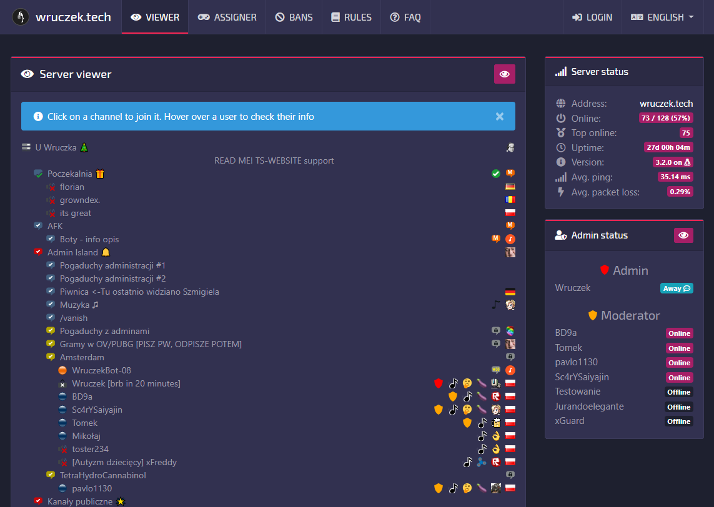

# ts-website — Benutzer- und Administratordokumentation



**Version:** 3.0 · **Sprache:** Deutsch  
*🇬🇧 [English version](../README.md)*

---

## Inhaltsverzeichnis

1. [Was ist ts-website?](#1-was-ist-ts-website)
   - 1.1 [Warum dieser Fork existiert](#11-warum-dieser-fork-existiert)
2. [Was du vor dem Start brauchst](#2-was-du-vor-dem-start-brauchst)
3. [Installation](#3-installation)
   - 3.1 [Das Kommandozeilenwerkzeug tsw.phar](#31-das-kommandozeilenwerkzeug-tswphar)
   - 3.2 [Den Web-Installer ausführen](#32-den-web-installer-ausführen)
   - 3.3 [Erstes Adminprofil einrichten](#33-erstes-adminprofil-einrichten)
4. [Die Website — Was Besucher sehen](#4-die-website--was-besucher-sehen)
   - 4.1 [Server-Viewer](#41-server-viewer)
   - 4.2 [Banliste](#42-banliste)
   - 4.3 [Regelseite](#43-regelseite)
   - 4.4 [FAQ-Seite](#44-faq-seite)
   - 4.5 [Gruppen-Assigner](#45-gruppen-assigner)
   - 4.6 [Anmelden](#46-anmelden)
   - 4.7 [Sprache wechseln](#47-sprache-wechseln)
   - 4.8 [Theme wechseln](#48-theme-wechseln)
   - 4.9 [Eingebettete Medien & Datenschutz](#49-eingebettete-medien--datenschutz)
5. [Das Admin-Panel](#5-das-admin-panel)
   - 5.1 [Zugang zum Admin-Panel](#51-zugang-zum-admin-panel)
   - 5.2 [News](#52-news)
   - 5.3 [FAQ verwalten](#53-faq-verwalten)
   - 5.4 [Regeleditor](#54-regeleditor)
   - 5.5 [Gruppen-Assigner konfigurieren](#55-gruppen-assigner-konfigurieren)
   - 5.6 [Impressum / Rechtliche Hinweise](#56-impressum--rechtliche-hinweise)
   - 5.7 [Website-Konfiguration](#57-website-konfiguration)
   - 5.8 [Theme-Hintergrundbilder](#58-theme-hintergrundbilder)
6. [Fehlerbehebung](#6-fehlerbehebung)
7. [Sicherheitshinweise](#7-sicherheitshinweise)

---

## 1. Was ist ts-website?

**ts-website** ist eine Website, die speziell für Communities entwickelt wurde, die einen **TeamSpeak-3**-Sprachserver betreiben. Sie gibt deinen Community-Mitgliedern einen Platz im Internet, an dem sie:

- sehen können, wer gerade auf deinem TeamSpeak-Server online ist — ohne TeamSpeak selbst öffnen zu müssen
- die Regeln und häufig gestellten Fragen deiner Community lesen können
- sich direkt über den Browser für Servergruppen bewerben können (z. B. „Member", „VIP", „Spiel: Minecraft")
- von Admins verfasste News lesen können
- nachschauen können, wer vom Server gebannt wurde und warum
- sich sicher mit ihrer TeamSpeak-Identität anmelden können — ohne separates Passwort

Stell dir die Seite als „Startseite" deiner TeamSpeak-Community vor.

Die Software läuft auf einem Webserver und verbindet sich im Hintergrund mit deinem TeamSpeak-Server. An TeamSpeak selbst muss nichts verändert werden.

### 1.1 Warum dieser Fork existiert

Das Original-ts-website von [Wruczek](https://github.com/Wruczek/ts-website) ist ein großartiges Stück Software — schlank, schnell und genau auf TeamSpeak-Communities zugeschnitten. Leider hat das Projekt seit mehreren Jahren keine größeren Updates mehr erhalten, und eine lang ersehnte Funktion ist bis heute nie angekommen: **ein richtiges Admin-Panel**. Ohne dieses mussten Server-Betreiber Datenbankzeilen direkt bearbeiten oder auf Umwege zurückgreifen, um einfach nur einen News-Beitrag zu veröffentlichen oder die Regeln zu aktualisieren.

Dieser Fork ([nodedropweb/ts-website](https://github.com/nodedropweb)) ändert das. Er fügt alles hinzu, was gefehlt hat:

- Ein **vollständiges Admin-Panel** — News, FAQ, Regeln, Impressum, Gruppen-Assigner und Website-Einstellungen lassen sich komplett über eine Weboberfläche verwalten, ohne Datenbankkenntnisse
- Ein **Kommandozeilen-Einrichtungswerkzeug** (`tsw.phar`) — vereinfacht Installation und Wartung ohne manuelles Bearbeiten von Konfigurationsdateien
- **PHP-8.4-Kompatibilität** — der ursprüngliche Code hatte sich im Laufe der Zeit PHP-Deprecations angesammelt, die auf modernen Servern zu Fehlern führten
- **DSGVO-konformes Asset-Hosting** — alle JavaScript- und CSS-Bibliotheken werden lokal bereitgestellt; es werden keine externen CDN-Anfragen an Drittanbieter gesendet
- **Zweisprachiges CLI** — das Einrichtungswerkzeug funktioniert auf Englisch und Deutsch

Dieser Fork bringt außerdem eine **gepatchte Version des TeamSpeak-3-PHP-Frameworks** mit ([nodedropweb/ts3phpframework](https://github.com/nodedropweb/ts3phpframework)), geforkt von der [originalen PlanetTeamSpeak-Bibliothek](https://github.com/planetteamspeak/ts3-php-framework). Die Originalbibliothek hatte mehrere Probleme, die auf PHP 8.4 zu Abstürzen und Speicherüberlauffehlern führten — all das wurde in unserem Fork behoben (siehe unten).

Wer das originale ts-website bereits kennt und liebt: Dieser Fork ist eine direkte Erweiterung davon. Alles, was vorher funktioniert hat, funktioniert weiterhin.

#### PHP-8.4-Fixes im TeamSpeak-Framework-Fork

Die originale `planetteamspeak/ts3-php-framework`-Bibliothek hatte sich im Laufe der Zeit mehrere PHP-8.x-Inkompatibilitäten angesammelt. Das sind die Änderungen im nodedropweb-Fork:

| Problem | Fix |
|---|---|
| **Speicherüberlauf in `StringHelper::split()`** — die Methode verwendete die eigene Zeichenanzahl des Strings als `explode()`-Limit, was beim Verarbeiten binärer TeamSpeak-Protokolldaten riesige Array-Allokationen verursachte | Behoben: Limit wird nur übergeben, wenn es explizit angegeben wurde; sonst wird `explode()` ohne Limit aufgerufen |
| **Speicherüberlauf in `StringHelper::toUtf8()`** — die Methode übergab alle 100+ Encodings aus `mb_list_encodings()` an `mb_convert_encoding()`, was PHP zwang, jedes Encoding der Reihe nach zu prüfen | Behoben: zuerst `mb_detect_encoding()` verwenden und nur konvertieren, wenn das erkannte Encoding nicht bereits UTF-8 ist |
| **PHP-8.4-Deprecation-Fehler — implizit nullable Parameter** — Dutzende Methoden in `Uri.php`, `Server.php`, `Host.php` u. a. deklarierten `Type $param = null` ohne die erforderliche `?Type`-Syntax | Alle betroffenen Signaturen auf explizite Nullable-Typen (`?Type`) oder Union-Typen (`Type\|null`) aktualisiert |
| **`TCP.php`-Absturz bei offline TeamSpeak-Server** — `stream_socket_client()` gibt `false` zurück, wenn der Server nicht erreichbar ist; der Code ließ `$this->stream` als `false` statt `null` stehen, was `fwrite(false, ...)` im Destruktor zum Absturz brachte | Behoben: `$this->stream = null` bei Verbindungsfehler setzen und `send()` gegen Nicht-Ressource-Streams absichern |
| **Namespace-Migration** — die Originalbibliothek verwendete die alte `TeamSpeak3_*`-Klassenbenennungskonvention, inkompatibel mit PHP-8-Autoloading-Standards | Alle Klassen in den Namespace `PlanetTeamSpeak\TeamSpeak3Framework\*` migriert; abwärtskompatible Aliase vorhanden |

---

## 2. Was du vor dem Start brauchst

Bevor du ts-website installierst, stelle sicher, dass Folgendes vorhanden ist. Falls du den Server nicht selbst verwaltest, frag deinen Hosting-Anbieter oder Server-Administrator.

| Anforderung | Details |
|---|---|
| **Webserver** | Apache 2.4 oder neuer, mit aktiviertem `mod_rewrite` |
| **PHP** | Version 8.1 oder neuer (8.4 empfohlen) |
| **PHP-Erweiterungen** | `pdo`, `pdo_mysql`, `mbstring`, `json`, `curl`, `fileinfo` |
| **Datenbank** | MariaDB 10.5+ oder MySQL 8.0+ |
| **Composer** | PHP-Paketverwaltung (zum Installieren der Abhängigkeiten) |
| **TeamSpeak-3-Server** | Version 3.10.0 oder neuer, mit ServerQuery-Zugang |
| **TeamSpeak-ServerQuery-Login** | Einen Query-Benutzernamen und ein Passwort mit mindestens Leserechten |
| **SSH- oder Terminalzugang** | Wird benötigt, um das `tsw.phar`-Einrichtungswerkzeug zu starten |

**Was ist ServerQuery?**  
TeamSpeak 3 verfügt über eine eingebaute Fernverwaltungsschnittstelle namens „ServerQuery". Sie erlaubt externen Programmen (wie ts-website), Informationen vom Server abzufragen und Befehle zu senden. Die ServerQuery-Zugangsdaten werden in der TeamSpeak-Server-Konfiguration oder über die TS3-Verwaltungswerkzeuge festgelegt.

---

## 3. Installation

### 3.1 Das Kommandozeilenwerkzeug tsw.phar

`tsw.phar` ist ein kleines Hilfsprogramm, das im Terminal (Kommandozeile) ausgeführt wird. Es übernimmt die technischen Installationsschritte, damit du sie nicht manuell erledigen musst.

**Grundlegende Verwendung:**

```bash
php tsw.phar <befehl>
```

Um alle verfügbaren Befehle anzuzeigen:

```bash
php tsw.phar help
```

**Sprachoptionen:**

Standardmäßig verwendet `tsw.phar` Englisch. Für einen einzelnen Befehl auf Deutsch umschalten:

```bash
php tsw.phar help --lang=de
```

Um Deutsch dauerhaft für die aktuelle Terminal-Sitzung zu aktivieren:

```bash
export TSW_LANG=de
```

Damit die Einstellung bei jedem neuen Terminal-Start gilt, füge diese Zeile zu deiner `~/.bashrc`-Datei hinzu.

**Verfügbare Befehle:**

| Befehl | Was er tut |
|---|---|
| `help` | Zeigt die Liste aller Befehle mit einer kurzen Beschreibung |
| `install` | Führt die vollständige Installation durch: lädt Composer-Pakete herunter und richtet benötigte Ordner und Berechtigungen ein |
| `update` | Aktualisiert die Software auf die neueste Version, nachdem du ein neues Release-Archiv heruntergeladen hast |
| `clear-cache` | Leert alle gecachten Seiten und Daten — nutze diesen Befehl, wenn etwas veraltet wirkt oder nach einer Konfigurationsänderung |
| `check` | Prüft, ob dein Server alle Software-Anforderungen erfüllt (PHP-Version, Erweiterungen usw.) |
| `version` | Zeigt die aktuell installierte Versionsnummer |

**Hilfe zu einem bestimmten Befehl:**

Jeder Befehl akzeptiert `--help`, um ausführliche Nutzungshinweise anzuzeigen:

```bash
php tsw.phar install --help
```

**Beispiel — vollständige Installation:**

```bash
cd /var/www/ts-website
php tsw.phar install
```

Folge den Anweisungen. Das Werkzeug führt dich Schritt für Schritt durch die Installation.

**Wann welcher Befehl genutzt werden sollte:**

- **Erstmalige Einrichtung:** zuerst `check` ausführen, dann `install`
- **Nach dem Herunterladen eines Software-Updates:** `update` ausführen, um Datenbankmigrationen anzuwenden und Abhängigkeiten zu aktualisieren
- **Etwas sieht auf der Website falsch aus:** `clear-cache` ausprobieren — damit lassen sich die meisten Anzeigeprobleme beheben, ohne irgendetwas neu starten zu müssen
- **Unbekannte installierte Version:** `version` ausführen

---

### 3.2 Den Web-Installer ausführen

Nach dem Ausführen von `php tsw.phar install` öffne deinen Browser und rufe folgende Adresse auf:

```
http://deine-domain.de/installer/
```

(Ersetze `deine-domain.de` durch die tatsächliche Adresse deines Servers.)

Der Installer führt dich durch **7 Schritte**:

1. **Willkommen** — Einführung und Sprachauswahl. Du kannst die Installer-Sprache über das Dropdown-Menü oben rechts wechseln.

2. **Anforderungen** — Der Installer prüft, ob dein Server alles Nötige hat (PHP-Version, Erweiterungen, Datenbankzugang). Grüne Häkchen bedeuten alles in Ordnung. Rote Fehler müssen behoben werden, bevor du fortfahren kannst.

3. **Datenbank** — Gib deine Datenbankverbindungsdaten ein:
   - **Host**: Normalerweise `127.0.0.1` oder `localhost`
   - **Datenbankname**: Der Name der Datenbank, die du für ts-website erstellt hast
   - **Benutzername** und **Passwort**: Die Zugangsdaten des Datenbankbenutzers
   
   Der Installer erstellt alle notwendigen Tabellen automatisch.

4. **TeamSpeak** — Gib deine TeamSpeak-Serververbindungsdaten ein:
   - **Host**: IP-Adresse oder Domain deines TeamSpeak-Servers
   - **ServerQuery-Port**: Normalerweise `10011`
   - **ServerQuery-Benutzername und Passwort**: Die Query-Zugangsdaten
   - **Virtueller Server-Port**: Normalerweise `9987` (der Port, über den Spieler sich verbinden)

5. **Sicherheit** — Wähle ein sicheres Admin-Passwort für das Webinterface (falls zutreffend) und konfiguriere sicherheitsrelevante Einstellungen.

6. **Konfiguration** — Lege grundlegende Website-Optionen fest, z. B. den Titel der Website und den Markennamen in der Navigationsleiste.

7. **Fertig** — Die Installation ist abgeschlossen. Der Installer sperrt sich selbst, damit er nicht erneut ausgeführt werden kann. Deine Website ist jetzt live.

> **Wichtig:** Sobald der Installer fertig ist, erstellt er eine Datei namens `private/INSTALLER_LOCK`. Diese verhindert, dass der Installer erneut ausgeführt wird. Lösche diese Datei nicht. Falls du jemals neu installieren musst, musst du sie manuell löschen — beachte jedoch, dass eine Neuinstallation deine bestehende Konfiguration überschreibt.

---

### 3.3 Erstes Adminprofil einrichten

Nach Abschluss des Installers musst du der Website mitteilen, wer der Administrator ist. Dies geschieht über eine einmalige Einrichtungsseite:

```
http://deine-domain.de/admin/setup.php
```

**Was du brauchst: deine Client-Datenbank-ID**

TeamSpeak identifiziert jeden Nutzer mit einer internen Zahl namens „Client-Datenbank-ID". Das ist *nicht* dein TeamSpeak-Nickname — es ist eine dauerhafte Nummer, die deinem Account auf diesem spezifischen Server zugewiesen ist.

**So findest du deine Client-Datenbank-ID in TeamSpeak:**

1. Öffne TeamSpeak 3
2. Verbinde dich mit deinem Server
3. Klicke oben im Menü auf **Extras**
4. Klicke auf **Mein TeamSpeak**
5. Suche das Feld **„Client-Datenbank-ID"** — notiere diese Zahl

Auf der Einrichtungsseite siehst du außerdem eine Liste der Benutzer, die gerade auf dem TeamSpeak-Server verbunden sind. Du kannst auf deinen eigenen Namen klicken, und deine ID wird automatisch eingetragen.

Trage die Zahl ein und klicke auf **Als Admin registrieren**. Die Seite sperrt sich dann (sie erstellt eine Datei namens `private/SETUP_LOCK`). Danach zeigt `setup.php` für jeden einen „403 Forbidden"-Fehler — das ist korrektes und erwartetes Verhalten.

> **Falls du den Admin später ändern musst:** Verbinde dich per SSH mit deinem Server, navigiere zu `src/private/` und lösche die Datei namens `SETUP_LOCK`. Besuche dann erneut `setup.php`, um eine neue Admin-ID einzutragen. Lösche die Sperrdatei nur, wenn du tatsächlich eine Änderung vornehmen musst.

---

## 4. Die Website — Was Besucher sehen

### 4.1 Server-Viewer

Der **Viewer** (über den Link „Viewer" in der Navigationsleiste erreichbar) zeigt eine Live-Momentaufnahme, wer gerade auf dem TeamSpeak-Server ist.

- Kanäle sind in der gleichen Reihenfolge wie in TeamSpeak aufgelistet
- Jeder Kanal zeigt die aktuell darin befindlichen Nutzer
- Benutzer-Icons und Gruppen-Abzeichen werden angezeigt (z. B. „Server Admin", „VIP")
- Der Viewer aktualisiert sich automatisch — kein manuelles Neuladen nötig
- **Leere Kanäle ausblenden:** Ein Button im Viewer ermöglicht es, Kanäle ohne aktive Nutzer auszublenden. Diese Einstellung wird in einem Cookie gespeichert und bleibt auch beim Neuladen der Seite oder bei späteren Besuchen erhalten.

Das ist praktisch für Community-Mitglieder, die sehen wollen, ob ihre Freunde online sind, bevor sie TeamSpeak öffnen.

### 4.2 Banliste

Die Seite **Bans** zeigt eine Tabelle der Nutzer, die vom Server gebannt wurden. Für jeden Ban werden folgende Informationen angezeigt:

- Der Nickname des Spielers zum Zeitpunkt des Bans
- Der Grund für den Ban (falls einer angegeben wurde)
- Wer den Ban ausgesprochen hat
- Wann der Ban ausläuft (oder „permanent", wenn er nie ausläuft)

Diese Seite ist standardmäßig öffentlich zugänglich.

### 4.3 Regelseite

Die Seite **Regeln** zeigt die von deinen Admins geschriebenen Community-Regeln. Der Inhalt wird vollständig im Admin-Panel verwaltet (siehe [Abschnitt 5.4](#54-regeleditor)).

### 4.4 FAQ-Seite

Die **FAQ**-Seite listet häufig gestellte Fragen und ihre Antworten auf. Alle Fragen und Antworten werden im Admin-Panel verwaltet (siehe [Abschnitt 5.3](#53-faq-verwalten)).

### 4.5 Gruppen-Assigner

Der **Gruppen-Assigner** ermöglicht angemeldeten Community-Mitgliedern, sich selbst bestimmten Servergruppen zuzuweisen — zum Beispiel Gruppen für bestimmte Spiele, Rollen oder optionale Kategorien.

> **Wichtig:** Nur Gruppen, die ein Admin in den Assigner-Einstellungen ausdrücklich aktiviert hat, erscheinen hier. Benutzer können sich über diese Funktion keine Admin-Level-Gruppen geben.

Um den Gruppen-Assigner zu nutzen, muss sich ein Besucher zuerst anmelden (siehe unten).

### 4.6 Anmelden

Besucher melden sich mit ihrer **TeamSpeak-Identität** an — kein separates Passwort erforderlich. Der Anmeldevorgang funktioniert wie folgt:

1. Klicke auf **Anmelden** in der Navigationsleiste
2. Gib deinen **TeamSpeak-Nickname** genau so ein, wie er im Client angezeigt wird
3. Die Website schickt dir einen **einmaligen Bestätigungscode** per TeamSpeak-„Poke" (eine kleine Benachrichtigung, die in deinem TeamSpeak-Client aufpoppt)
4. Gib diesen Code auf der Website ein
5. Du bist jetzt angemeldet

> **Der Code kommt nicht an?**
> - Stelle sicher, dass du beim Anmeldeversuch **mit dem Server verbunden** bist
> - Prüfe, ob du deinen Nickname korrekt eingegeben hast (Groß-/Kleinschreibung beachten)
> - Es gibt eine Abklingzeit von **120 Sekunden** zwischen Anmeldeversuchen — warte 2 Minuten und versuche es erneut
> - Stelle sicher, dass TeamSpeak-Poke-Benachrichtigungen in deinen Client-Einstellungen nicht deaktiviert sind

Nach der Anmeldung erscheint dein Benutzername in der Navigationsleiste. Klicke darauf, um die Abmeldeoption aufzurufen.

### 4.7 Sprache wechseln

Die Website erkennt automatisch die bevorzugte Sprache deines Browsers und verwendet die nächste verfügbare Übersetzung. Um manuell zu wechseln:

1. Klicke auf die **Sprachauswahl** in der Navigationsleiste (angezeigt als Globus-Symbol mit dem aktuellen Sprachnamen)
2. Wähle deine bevorzugte Sprache aus dem Dropdown-Menü

Die Website unterstützt **24 Sprachen**, darunter Deutsch, Englisch, Französisch, Spanisch, Polnisch, Russisch, Türkisch, Chinesisch (Vereinfacht), Arabisch und viele mehr.

---

### 4.8 Theme wechseln

ts-website enthält **sechs visuelle Themes**, zwischen denen jeder Besucher jederzeit wechseln kann. Das gewählte Theme wird in einem Cookie gespeichert und bleibt über Seitenreloads und Browser-Neustarts hinweg erhalten.

**So wechselst du das Theme:**

1. Klicke auf das **Palette-Symbol** (🎨) in der Navigationsleiste — es befindet sich zwischen dem Login-Button und der Sprachauswahl
2. Ein Dropdown erscheint mit allen verfügbaren Themes
3. Klicke auf einen Theme-Namen, um ihn sofort anzuwenden — kein Seitenreload erforderlich

**Verfügbare Themes:**

| Theme | Beschreibung |
|---|---|
| **Dark** | Das klassische dunkle Lila/Pink-Design — die Standardeinstellung |
| **Light** | Aufgeräumtes helles Layout mit Indigo-Akzenten |
| **Acrylic** | Mattglas-Panels über einem Picsum-Hintergrundbild — Violett/Lila-Tönung |
| **Acrylic Midnight** | Gleicher Mattglas-Effekt — tiefblau/Cyan-Tönung |
| **Acrylic Ember** | Mattglas — warme Orange/Bernstein-Tönung |
| **Acrylic Forest** | Mattglas — kühle Grün/Smaragd-Tönung |

Die vier **Acrylic**-Themes verwenden ein fotografisches Hintergrundbild (zufällige Landschaft von [picsum.photos](https://picsum.photos)) mit einem halbtransparenten Blur auf allen Panels. Wenn ein Server-Admin ein eigenes Hintergrundbild für ein Theme hochgeladen hat (siehe [Abschnitt 5.8](#58-theme-hintergrundbilder)), wird dieses statt des Picsum-Fallbacks verwendet.

---

### 4.9 Eingebettete Medien & Datenschutz

ts-website verwendet **[Klaro](https://github.com/kiprotect/klaro)** als datenschutzfreundlichen Consent-Manager für eingebettete Drittanbieter-Medien. Dies betrifft Inhalte, die Admins auf der Regelseite, in FAQ-Antworten oder in News-Beiträgen einfügen — zum Beispiel ein YouTube-Tutorial oder ein Vimeo-Clip.

#### Was Besucher sehen

Beim ersten Aufruf einer Seite mit eingebettetem Video erscheint am unteren Bildschirmrand ein kurzer Hinweisbalken:

> *„Diese Seite bettet externe Medien (YouTube, Vimeo) ein. Bitte stimme zu, damit eingebettete Inhalte geladen werden dürfen."*

Besucher können:
- **Alle akzeptieren** — Video-Embeds laden sofort, die Entscheidung wird 365 Tage lang gespeichert
- **Lassen Sie mich wählen** — öffnet ein Einstellungsfenster, in dem YouTube und Vimeo einzeln ein- oder ausgeschaltet werden können
- **Ablehnen** — Embeds bleiben blockiert; an ihrer Stelle wird ein Platzhalter angezeigt

Die Einstellung wird im Cookie `tswebsite_klaro` gespeichert. Nach einmaliger Zustimmung spielen Videos auf allen Seiten normal ab — keine zweite Abfrage.

#### Technischer Hintergrund

Beim Rendern einer Seite schreibt der Server alle `<iframe src="https://www.youtube.com/...">` oder `<iframe src="https://vimeo.com/...">` in nutzergenerierten Inhalten so um, dass sie `data-src` statt `src` verwenden. Der Browser kontaktiert YouTube oder Vimeo also erst dann, wenn der Besucher ausdrücklich zugestimmt hat. Klaro tauscht `data-src` clientseitig wieder gegen `src` aus, sobald die Erlaubnis erteilt wurde.

Alle Klaro-Dateien (`klaro.js`, `klaro.min.css`) werden lokal aus `lib/klaro/0.7/` ausgeliefert — es werden keine externen CDN-Anfragen gestellt.

#### Unterstützte Dienste

| Dienst | Erkannte URLs |
|--------|--------------|
| YouTube | `youtube.com`, `youtube-nocookie.com`, `youtu.be` |
| Vimeo | `vimeo.com`, `player.vimeo.com` |

---

## 5. Das Admin-Panel

### 5.1 Zugang zum Admin-Panel

Das Admin-Panel ist unter folgender Adresse erreichbar:

```
http://deine-domain.de/admin/
```

Um darauf zuzugreifen, musst du **mit dem TeamSpeak-Account angemeldet sein, der bei der Einrichtung als Admin registriert wurde**. Falls du eine „403 Forbidden"-Seite siehst, liegt das entweder daran:

- Du bist nicht angemeldet — klicke zuerst auf Anmelden in der Navigationsleiste
- Du bist mit dem falschen TeamSpeak-Account angemeldet — melde dich ab und melde dich mit deinem Admin-Account an
- Deine Client-Datenbank-ID ist nicht als Admin in der Konfiguration eingetragen

Das Admin-Panel verfügt oben über eine Navigationsleiste mit Links zu allen Verwaltungsbereichen.

---

### 5.2 News

Der Bereich **News** ermöglicht es dir, Ankündigungen und Updates für deine Community zu veröffentlichen.

**Einen neuen News-Beitrag erstellen:**

1. Klicke im Admin-Panel auf **News**
2. Klicke auf **Neuer Beitrag** (oder die entsprechende Schaltfläche)
3. Gib einen **Titel** und den **Inhalt** deines Beitrags ein
4. Klicke auf **Speichern**

Der Beitrag erscheint sofort auf der Startseite der Website.

**Einen Beitrag bearbeiten oder löschen:**

Klicke auf das Bearbeitungs-Symbol (Stift) oder das Lösch-Symbol (Mülleimer) neben einem vorhandenen Beitrag in der Liste.

News-Beiträge unterstützen grundlegende HTML-Formatierung — du kannst `<b>` für Fettschrift, `<i>` für Kursivschrift usw. verwenden.

---

### 5.3 FAQ verwalten

Der Bereich **FAQ** ermöglicht die Verwaltung einer Liste häufig gestellter Fragen, die auf der öffentlichen FAQ-Seite erscheinen.

**Einen neuen FAQ-Eintrag hinzufügen:**

1. Klicke in der Admin-Navigation auf **FAQ**
2. Klicke auf **Frage hinzufügen**
3. Gib die **Frage** und die **Antwort** ein
4. Klicke auf **Speichern**

**Fragen neu anordnen:** Ziehe die Einträge per Drag-and-Drop in der Liste (falls unterstützt), oder bearbeite deren Reihenfolgennummern.

**Bearbeiten oder löschen:** Klicke auf die entsprechenden Symbole neben jedem Eintrag.

---

### 5.4 Regeleditor

Der **Regeleditor** ermöglicht es dir, die Regeln deiner Community zu schreiben und zu aktualisieren. Die Regeln werden öffentlich auf der Regelseite angezeigt.

Der Editor unterstützt grundlegende Textformatierung. Schreibe deine Regeln in das Textfeld und klicke auf **Speichern**. Die Änderung tritt sofort in Kraft.

---

### 5.5 Gruppen-Assigner konfigurieren

Der Admin-Bereich **Gruppen-Assigner** ermöglicht es dir zu steuern, welche TeamSpeak-Servergruppen sich Community-Mitglieder selbst zuweisen können.

**Eine Gruppe für die Selbstzuweisung aktivieren:**

1. Klicke in der Admin-Navigation auf **Assigner**
2. Du siehst eine Liste aller Servergruppen von deinem TeamSpeak-Server
3. Aktiviere oder deaktiviere den Schalter neben einer Gruppe, um sie im öffentlichen Gruppen-Assigner verfügbar zu machen (oder nicht)

Nur Gruppen, die du ausdrücklich aktivierst, sind für Nutzer auf der Assigner-Seite sichtbar. Gruppen, die du nicht aktivierst (einschließlich Admin-Gruppen), werden dort niemals angezeigt.

**Anwendungsbeispiele:**

- Eine Gruppe „Spiel: Minecraft", der Spieler sich selbst hinzufügen können
- Eine Gruppe „Benachrichtigungen: Events" als Opt-in für Veranstaltungsankündigungen
- Eine Gruppe „Sprache: Deutsch" zur Selbstsortierung

---

### 5.6 Impressum / Rechtliche Hinweise

In vielen Ländern (insbesondere in der EU) sind Websites gesetzlich dazu verpflichtet, ein Impressum mit Kontaktinformationen anzuzeigen. Der Bereich **Impressum** ermöglicht die Verwaltung dieser Informationen.

**Das Impressum konfigurieren:**

1. Klicke auf den entsprechenden Link im Admin-Panel
2. Navigiere zu **Impressum bearbeiten**
3. **Impressum aktivieren:** Schalte dies ein, wenn du ein rechtliches Impressum anzeigen musst
4. **Impressum-URL:** Gib die Webadresse deiner vollständigen Impressumsseite ein (das kann eine externe Seite sein, z. B. auf deiner persönlichen Website)
5. **Impressum-Inhalt:** Gib den Text ein, der angezeigt werden soll (wenn das Impressum direkt eingebettet statt als Link angezeigt wird)
6. Klicke auf **Speichern**

Wenn das Impressum aktiviert ist, erscheint im Footer der Website ein Link mit der Bezeichnung **„Impressum"** (oder die übersetzte Entsprechung in der Sprache des Besuchers).

---

### 5.7 Website-Konfiguration

Der Bereich **Konfiguration** enthält allgemeine Einstellungen für deine Website.

Häufige Einstellungen:

| Einstellung | Beschreibung |
|---|---|
| **Website-Titel** | Der Name, der im Browser-Tab und im Seitentitel angezeigt wird |
| **Navigations-Markenname** | Der Name oben links in der Navigationsleiste |
| **TeamSpeak-Server-Adresse** | Die Adresse, die Spieler zum Verbinden nutzen (wird auf der Viewer-Seite angezeigt) |
| **News aktiviert** | News-Bereich ein- oder ausblenden |
| **Bans aktiviert** | Öffentliche Banliste ein- oder ausblenden |
| **Assigner aktiviert** | Gruppen-Assigner ein- oder ausblenden |
| **Cookie-Hinweis** | DSGVO-Cookie-Hinweisbanner aktivieren oder deaktivieren |

Nach dem Ändern einer Einstellung auf **Speichern** klicken. Die meisten Änderungen wirken sofort; falls sich etwas nicht aktualisiert, versuche den Cache zu leeren mit `php tsw.phar clear-cache`.

---

### 5.8 Theme-Hintergrundbilder

Die vier **Acrylic**-Themes unterstützen jeweils ein eigenes Hintergrundbild, das das Standard-Picsum-Foto ersetzt. Die Verwaltung erfolgt im Bereich **Themes** des Admin-Panels.

**So lädst du ein eigenes Hintergrundbild hoch:**

1. Öffne das Admin-Panel und klicke auf **Themes** in der Navigationsleiste
2. Du siehst vier Karten — eine für jede Acrylic-Theme-Variante
3. Jede Karte zeigt das aktuelle Hintergrundbild (oder einen Platzhalter, wenn noch keines hochgeladen wurde)
4. Klicke auf **Durchsuchen** (bzw. **Choose image…**) auf der Karte des gewünschten Themes
5. Wähle eine JPEG-, PNG- oder WebP-Datei von deinem Computer aus (maximal 8 MB)
6. Klicke auf **Upload**
7. Das Bild wird automatisch auf maximal 1920 Pixel Breite skaliert und als JPEG auf dem Server gespeichert
8. Die Seite lädt neu und zeigt eine Vorschau des hochgeladenen Bildes

**Badge-Anzeigen:**

- **Custom image** (grün) — für dieses Theme wurde ein eigenes Bild hochgeladen
- **Picsum fallback** (grau) — kein eigenes Bild vorhanden; das Theme verwendet ein zufälliges Picsum-Foto

**So entfernst du ein eigenes Bild:**

Klicke auf den **Remove**-Button (rot, Papierkorb-Symbol) auf der Theme-Karte. Das Theme kehrt sofort zum Picsum-Fallback zurück.

> **Hinweis:** Änderungen an Hintergrundbildern wirken sofort für alle Besucher — es muss kein Cache geleert werden.

---

## 6. Fehlerbehebung

### „Ich sehe rohen Text wie LOGIN_CONFIRMATION_CODE statt einer echten Meldung"

Das bedeutet, dass ein Übersetzungsschlüssel für deine gewählte Sprache fehlt. Die Website konnte den übersetzten Text nicht finden und hat stattdessen den internen Schlüsselnamen angezeigt.

**Lösung:** Dies ist ein Software-Problem. Prüfe, ob die Übersetzungsdatei deiner Sprache vollständig ist. Falls du eine kürzlich hinzugefügte Sprache verwendest oder die Sprachdateien angepasst hast, vergleiche mit der englischen Datei (`en/frontend.po`) und ergänze die fehlenden Einträge.

### „Der Anmelde-Poke kommt nie an"

- Stelle sicher, dass du beim Anmeldeversuch **mit dem TeamSpeak-Server verbunden** bist
- Prüfe, ob dein TeamSpeak-Nickname exakt korrekt eingegeben ist (Groß-/Kleinschreibung beachten)
- Warte mindestens **2 Minuten** zwischen Versuchen — es gibt eine eingebaute Abklingzeit, um Spam zu verhindern
- Prüfe, ob TeamSpeak-**Poke-Benachrichtigungen** in deinem Client aktiviert sind (Rechtsklick auf den Servernamen → Bearbeiten → Benachrichtigungen)

### „Das gespeicherte Impressum / die Regeln / die News werden nicht angezeigt"

- Leere den Website-Cache: `php tsw.phar clear-cache`
- Warte einige Sekunden und lade die Seite neu
- Falls das Problem anhält, prüfe, ob deine Datenbankverbindung korrekt funktioniert

### „Das Admin-Panel zeigt 403 Forbidden"

- Du bist entweder nicht angemeldet, oder mit dem falschen TeamSpeak-Account angemeldet
- Melde dich mit dem TeamSpeak-Account an, dessen Client-Datenbank-ID bei der Einrichtung eingegeben wurde
- Falls du die Admin-ID ändern musst, lösche `src/private/SETUP_LOCK` und besuche erneut `/admin/setup.php`

### „setup.php zeigt Forbidden, obwohl ich der Admin bin"

- Das ist korrekt. Nach der Registrierung des ersten Admins sperrt sich `setup.php` dauerhaft
- Um sie erneut zu aktivieren, verbinde dich per SSH und lösche die Datei `src/private/SETUP_LOCK`
- Tu dies nur, wenn du den Admin tatsächlich neu registrieren musst — die Datei schützt dich

### „Die Website zeigt veraltete Daten / gecachten Inhalt"

Führe folgendes im Terminal aus:

```bash
php tsw.phar clear-cache
```

Dadurch werden alle gecachten Seiten und Daten entfernt. Beim nächsten Seitenaufruf werden frische Daten vom TeamSpeak-Server und der Datenbank abgerufen.

### „Der Server-Viewer zeigt nichts / alle Kanäle sind leer"

- Dein TeamSpeak-Server könnte offline oder vom Webserver aus nicht erreichbar sein
- Prüfe, ob die ServerQuery-Zugangsdaten in deiner Konfiguration korrekt sind
- Stelle sicher, dass der ServerQuery-Port des TeamSpeak-Servers (Standard: `10011`) vom Webserver aus erreichbar ist
- Prüfe das Fehlerprotokoll deines Webservers auf Verbindungsfehler

### „Ich bekomme einen 500 Internal Server Error"

- Aktiviere vorübergehend die PHP-Fehlerausgabe und lade die Seite neu, um die tatsächliche Fehlermeldung zu sehen
- Prüfe das Apache-Fehlerprotokoll: normalerweise unter `/var/log/apache2/error.log` zu finden
- Häufige Ursachen: fehlende Composer-Pakete (führe erneut `php tsw.phar install` aus), falsche Dateiberechtigungen oder ein Datenbankverbindungsfehler

---

## 7. Sicherheitshinweise

- **Gib niemals deine ServerQuery-Zugangsdaten weiter.** Wer ServerQuery-Zugang hat, kann deinen TeamSpeak-Server steuern.
- **Das Verzeichnis `src/private/` darf nicht über das Web erreichbar sein.** Es enthält deine Konfiguration, Datenbankzugangsdaten und Sperrdateien. Wenn dein Webserver korrekt konfiguriert ist (mit den mitgelieferten `.htaccess`-Regeln), ist dieses Verzeichnis bereits geschützt.
- **Lasse die Dateien `INSTALLER_LOCK` und `SETUP_LOCK` an ihrem Platz.** Sie verhindern, dass Installer und Setup-Seite erneut ausgeführt werden. Lösche sie nur, wenn du diese Schritte gezielt neu ausführen musst.
- **Halte deine Software aktuell.** Führe regelmäßig `php tsw.phar update` aus, um Sicherheitsfixes zu erhalten.
- **Alle Assets (JavaScript, CSS) werden lokal bereitgestellt** — es werden keine Daten an externe CDNs gesendet. Das entspricht den Anforderungen der DSGVO.

---

*Dokumentation für ts-website v3.0. Originalsoftware von [Wruczek](https://github.com/Wruczek/ts-website), Fork und Erweiterungen von [nodedropweb](https://github.com/nodedropweb).*

---

### 5.9 Manuelle TeamSpeak-Icon-Synchronisation

Wenn du Icons auf deinem TeamSpeak-Server hinzufügst oder änderst (z. B. für neue Servergruppen), zeigt die Website aufgrund des Cachings unter Umständen noch die alten oder gar keine Icons an. Du kannst eine Synchronisation manuell erzwingen, um den lokalen Icon-Cache zu aktualisieren:

1. Navigiere im Admin-Bereich zu **Konfiguration -> Allgemeine Einstellungen**
2. Scrolle nach unten zum Bereich **TeamSpeak Channel- & Gruppen-Icons**
3. Klicke auf die Schaltfläche **Icons vom Server synchronisieren**

Die Website lädt sofort alle fehlenden oder aktualisierten Icons vom TeamSpeak-Server herunter. Nach Abschluss des Vorgangs erscheint eine Erfolgsmeldung.

---

### 5.10 Favicon & Site-Icon Verwaltung

Du kannst die Icons anpassen, die im Browser-Tab und auf mobilen Startbildschirmen angezeigt werden:

1. Navigiere im Admin-Bereich zu **Konfiguration -> Allgemeine Einstellungen**
2. Scrolle zum Bereich **Favicon & Site-Icon**
3. **Favicon**: Lade ein Bild hoch (PNG, JPEG, WebP oder ICO). Das System generiert automatisch die erforderlichen Größen 16x16 und 32x32.
4. **Site-Icon**: Lade ein größeres Logo hoch (Apple Touch Icon). Dieses Icon wird auch als **Hauptlogo in der Navigationsleiste** verwendet.
5. Nutze die Schaltfläche **Löschen** neben jedem Icon, um jederzeit zu den Standard-TeamSpeak-Icons zurückzukehren.

---

### 5.11 SEO & Social Media Einstellungen

Um zu verbessern, wie deine Website in Suchmaschinen und beim Teilen auf Plattformen wie Discord oder Facebook erscheint:

1. Navigiere im Admin-Bereich zu **Konfiguration -> SEO & Social Media**
2. **Meta-Beschreibung**: Gib eine prägnante Zusammenfassung deiner Community ein (empfohlen: 150-160 Zeichen). Dieser Text wird von Suchmaschinen verwendet.
3. **Social-Media-Titel (OG:Title)**: Lege einen speziellen Titel für Social-Media-Freigaben fest. Wenn das Feld leer bleibt, wird der Standard-Websitename verwendet.
4. **Vorschaubild (OG:Image)**: Lade ein hochwertiges Vorschaubild hoch. Das System wird es **automatisch auf das optimale Format von 1200x630 Pixeln zuschneiden und skalieren**.

Die Änderungen treten sofort in Kraft. Du kannst das Erscheinungsbild mit Tools wie dem Facebook Sharing Debugger überprüfen.
